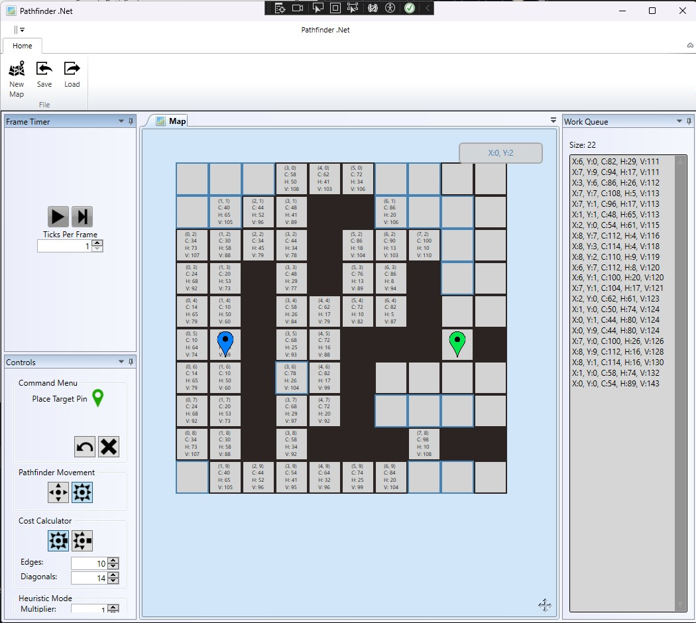
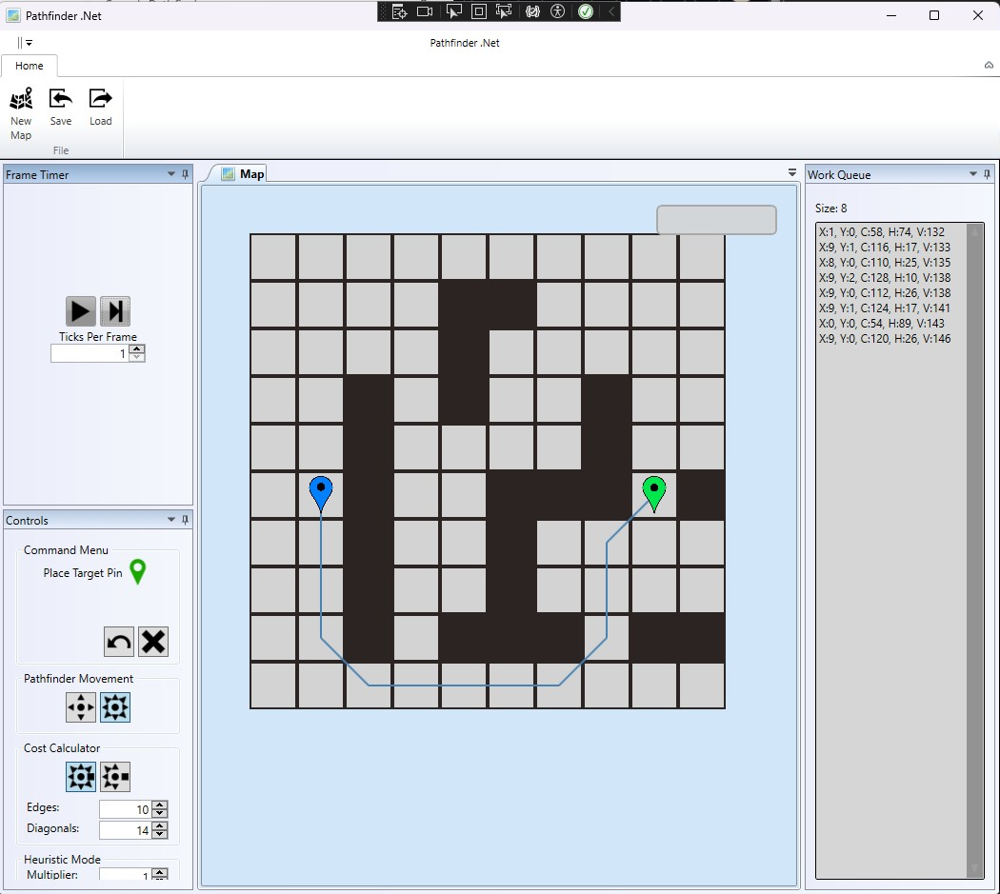
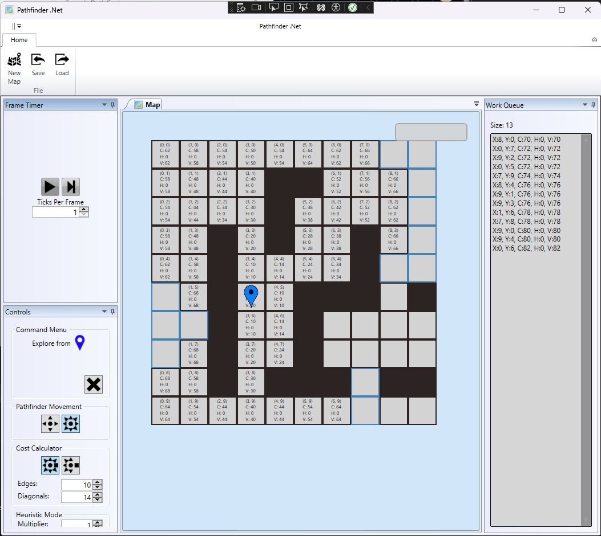
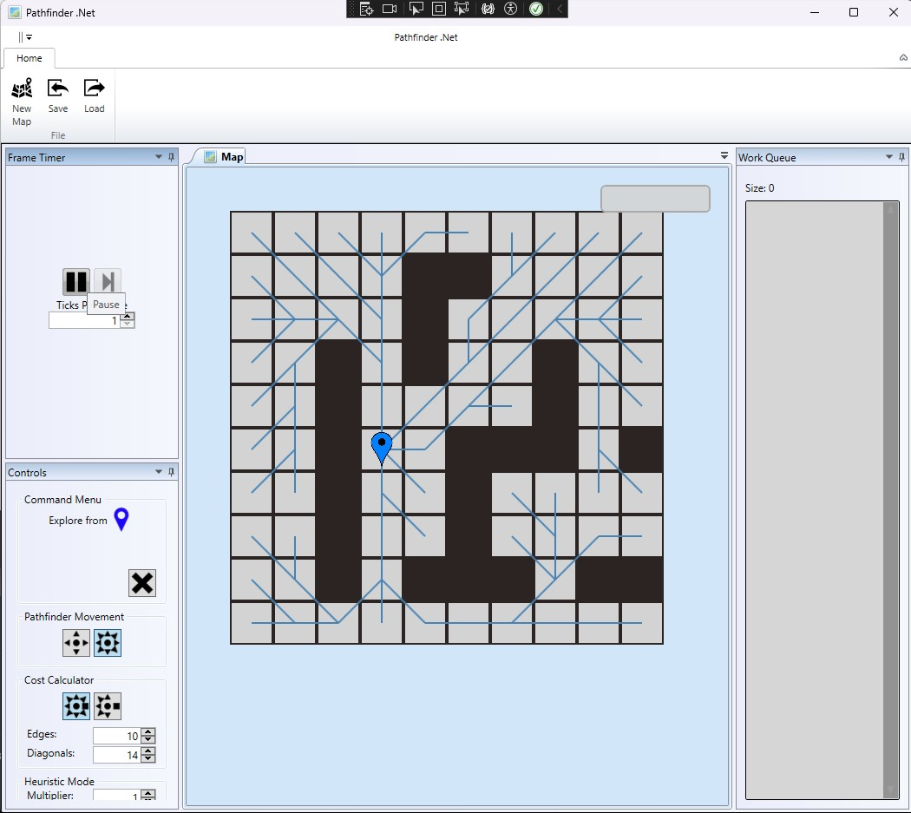

# Pathfinder.Net
WPF app with a configurable pathfinding algorythm to play around with path exploration logic.

## Project History
This project was a post Uni project originally hosted on CodePlex under https://pathfinder.codeplex.com/, but the site no-longer exists.

The goal was to demonstrate various pathfinding algorythms while learning WPF when it came out in 2006...

Ported to github ~2015.

Surprised it still compiles...

## Current Features
* WPF UI
* Basic on / off cell map editor with Pan and Zoom
* Generic A* Pathfinder library
* Core library has no dependencies on any platform specific libraries
* Configurable tick timer
* Different movement types (4 and 8 direction)
* Configurable Heuristics (Zero and Targeted)
* Configurable Cost Calculator (Directional costs, sharp corners)
* Solution overlay
* Map Load / Save

## Point to Point
### Solving

### Solved

## Saturation Search
### Solving

### Solved
